#  Pizza Runner — 8 Week SQL Challenge
A SQL case study solving Danny Ma's Pizza Runner challenge — covering data cleaning, pizza metrics, runner/customer experience, ingredient optimisation, pricing, and ratings. Written and tested in MySQL Workbench.

## Overview
- **Tool used:** MySQL Workbench
- **Dataset:** 6 tables — `runners`, `customer_orders`, `runner_orders`, `pizza_names`, 
  `pizza_recipes`, `pizza_toppings`
- ** Question Sections:** Pizza Metrics, Runner & Customer Experience, Ingredient Optimisation, 
  Pricing & Ratings, Bonus DML Challenge

## Setup
Before running any analysis, the database schema and raw data need to be created:

- [Create Tables](./Queries/01_create_tables.sql) — creates all 6 tables 
  (`runners`, `customer_orders`, `runner_orders`, `pizza_names`, `pizza_recipes`, `pizza_toppings`)
- [Insert Table](./Queries/02_insert_tables.sql) — loads the raw sample data into each table
  
## Data Cleaning
The raw `customer_orders` and `runner_orders` tables had inconsistent null values (blank strings, `'null'`, `'NaN'`) and messy text in `distance`, `duration`, and `pickup_time` (e.g. `"20km"`, `"32 minutes"`). I also found and corrected a data 
entry error where three `pickup_time` values were logged in 2020 instead of 2021, which made no sense since pickup can't happen before the order was placed.

## A. Pizza Metrics

Queries: [Pizza Metrics](./Queries/04_pizza_metrics.sql)

**A1. How many pizzas were ordered?**

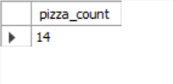

**A2. How many unique customer orders were made?**

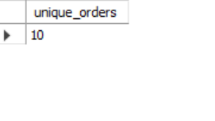

**A3. How many successful orders were delivered by each runner?**

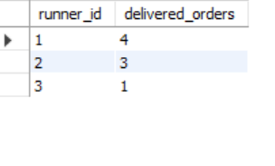

**A4. How many of each type of pizza was delivered?**

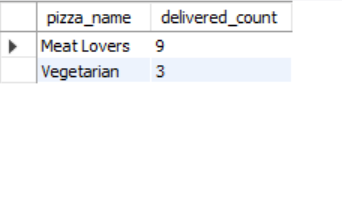

**A5. How many Vegetarian and Meatlovers were ordered by each customer?**
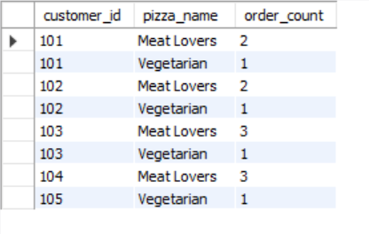

**A6. What was the maximum number of pizzas delivered in a single order?**

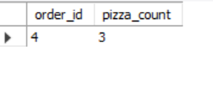

**A7. For each customer, how many delivered pizzas had at least 1 change and how many had no changes?**
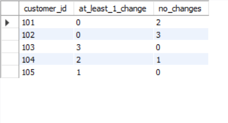

**A8. How many pizzas were delivered that had both exclusions and extras?**

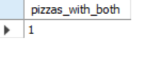

**A9. What was the total volume of pizzas ordered for each hour of the day?**
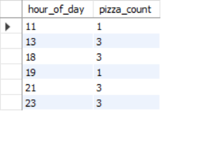

**A10. What was the volume of orders for each day of the week?**

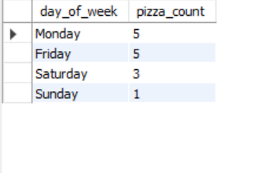

## B. Runner and Customer Experience
Queries: [Runner and Customer Experience](./Queries/05_runner_and_customer_experience.sql)

**B1. How many runners signed up for each 1 week period?**

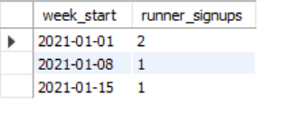

**B2. What was the average time in minutes it took for each runner to arrive at HQ to pickup the order?**
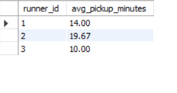

**B3. Is there any relationship between the number of pizzas and how long the order takes to prepare?**
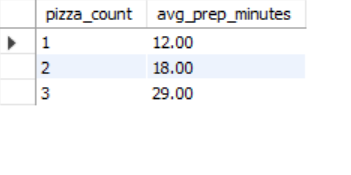

**B4. What was the average distance travelled for each customer?**

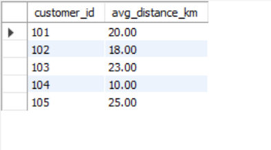

**B5. What was the difference between the longest and shortest delivery times for all orders?**
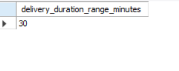

**B6. What was the average speed for each runner for each delivery and do you notice any trend?**
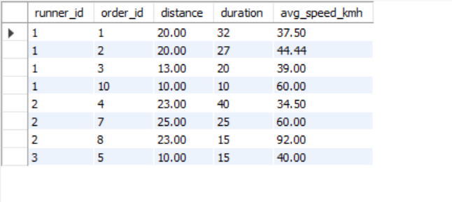

**B7. What is the successful delivery percentage for each runner?**

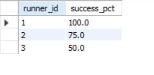

## C. Ingredient Optimisation

Queries: [C_ingredient_optimisation.sql](./Queries/06_ingredient_optimisation.sql)

**C1. What are the standard ingredients for each pizza?**

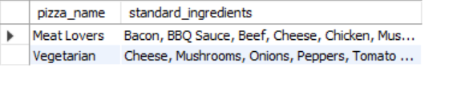

**C2. What was the most commonly added extra?**

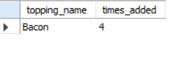

**C3. What was the most common exclusion?**

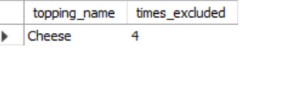

**C4. Generate an order item for each record in the customer_orders table**
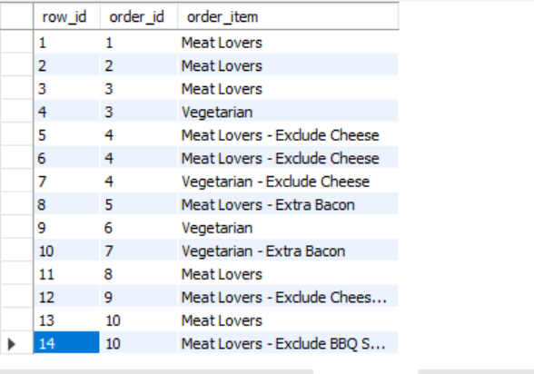

**C5. Generate an alphabetically ordered, coma separated ingredient list for each pizza order**
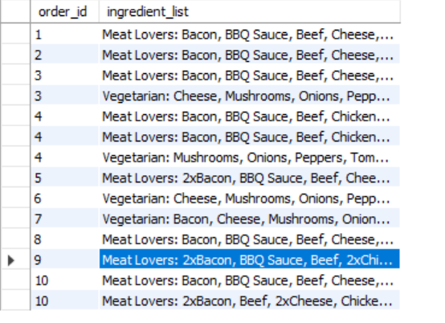

**C6. What is the total quantity of each ingredient used in all delivered pizzas, sorted by most frequent first?**
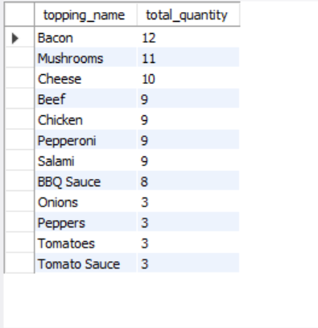

## D. Pricing and Ratings

Queries: [Pricing_and_Ratings](./Queries/07_pricing_and_ratings.sql)

**D1. Revenue if Meat Lovers is $12, Vegetarian is $10, no delivery fees, no charge for changes**
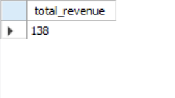

**D2. Same, but with an additional $1 charge for any pizza extras**

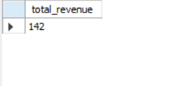

**D3. Ratings system table design + sample data**

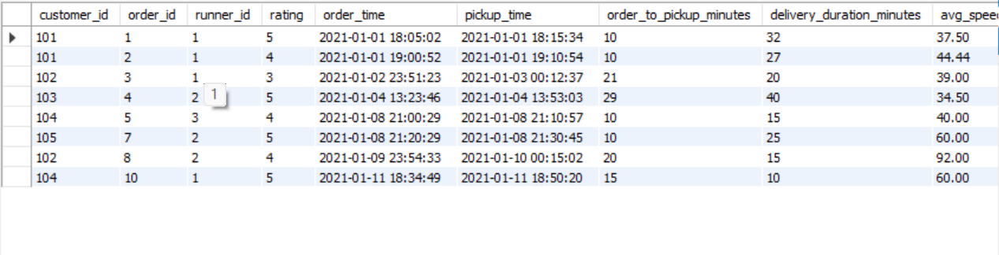

**D4. Joined table with customer_id, order_id, runner_id, rating, order_time, pickup_time, time between order and pickup, delivery duration, average speed, total pizzas**

**D5. Net revenue after paying runners $0.30/km, with fixed pizza prices and no cost for extras**
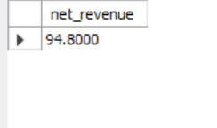

## E. Bonus — Adding a New Pizza

Queries: [Bonus Question](./Queries/08_bonus_questions.sql)

**E1. If Danny wants to expand the pizza range — how does this affect the data design, and what does the INSERT for a "Supreme" pizza look like?**

## Key Learnings
- Handling inconsistent null representations (`''`, `'null'`, `'NaN'`) in raw data
- Identifying and correcting a real data entry error (wrong year in timestamps)
- MySQL restriction: a `TEMPORARY` table cannot be referenced twice in the same query — 
  switched to regular tables to solve thi
- Using CTEs, window functions (`ROW_NUMBER()`), and string functions 
  (`REGEXP_REPLACE`, `SUBSTRING_INDEX`) to clean and reshape messy data
- Practicing multi-table joins across a 6-table relational schema
